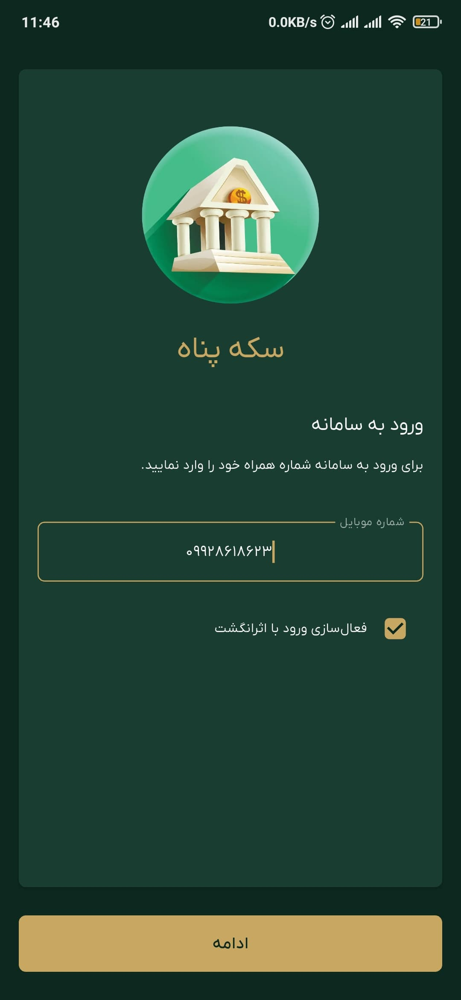
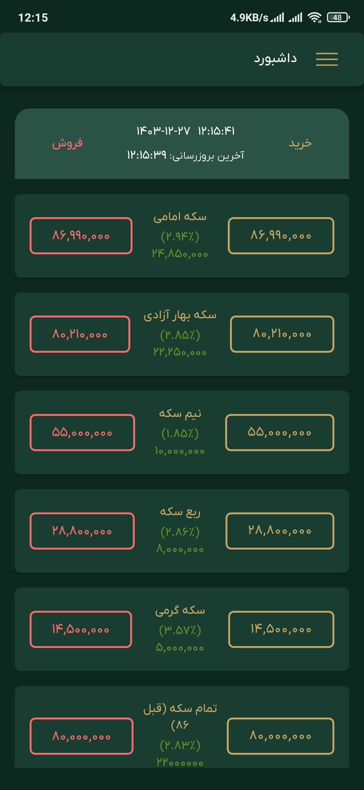
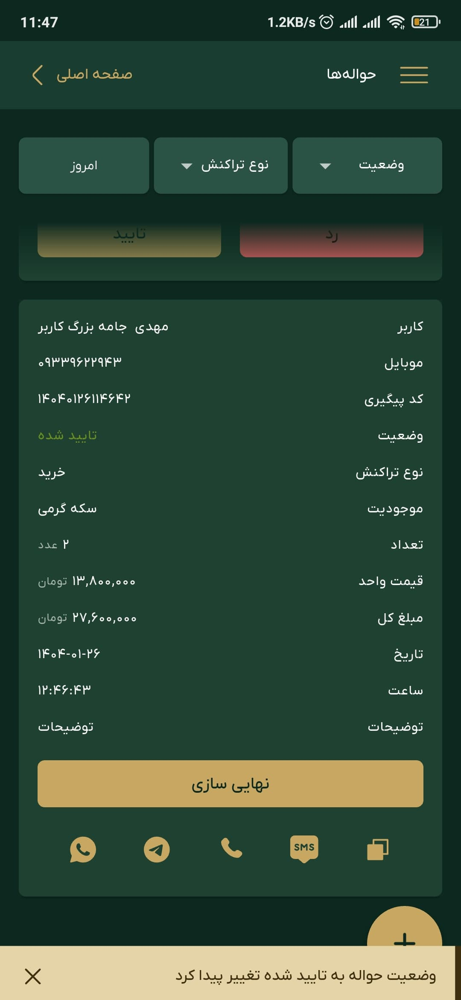
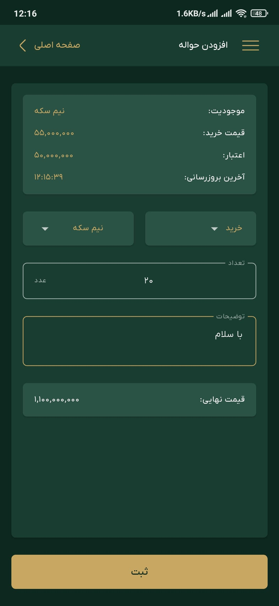
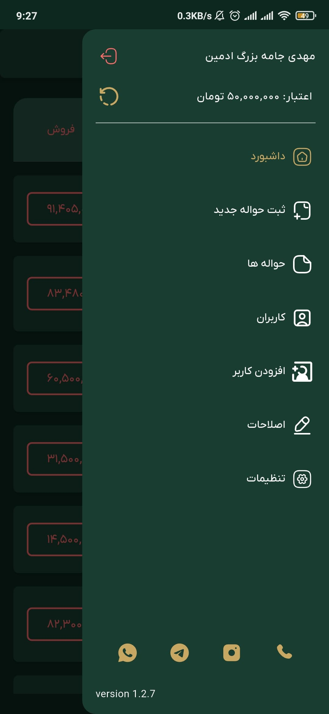
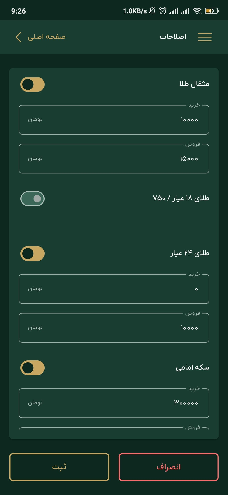
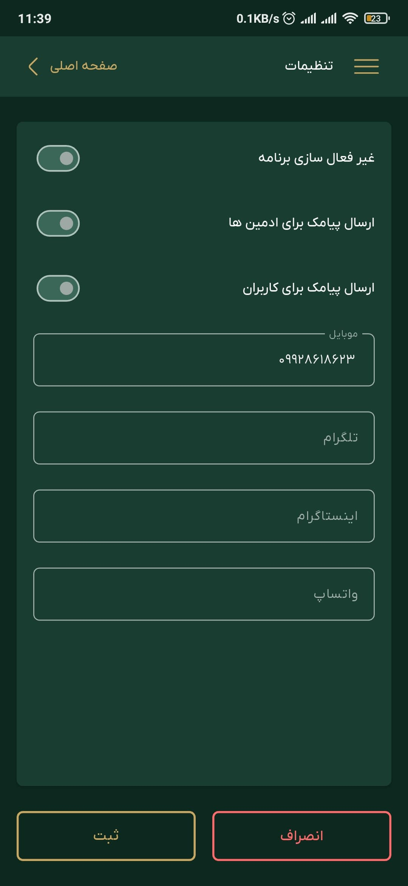

# Panah Coin - FinTech Gold trading B2B app

[](https://flutter.dev)
[](#)
[](#)

**Panah Coin** is an enterprise-grade B2B FinTech and gold trading ecosystem engineered for asset managers and verified merchants. The platform facilitates real-time commodity pricing, secure transaction ledgers, multi-tier Role-Based Access Control (RBAC), and precise financial calculations, deployed across native mobile platforms and a high-performance Progressive Web Application (PWA).

---

## 🔗 Production Context

* **Live Production PWA Deployment:** [Panah Coin Trading Portal](https://mahdijamebozorg.github.io/panah-coin/)
* **Architecture Standard:** Decoupled Business Service Layers with Atomic Component Injection.

---

## 📌 Core Engineering Highlights & Innovations

* **Role-Based Access Control (RBAC Engine):** Designed a multi-layered authentication and permission matrix ensuring secure UI rendering and dynamic route masking depending on user roles (Admin, Merchant, Operator).
* **Real-Time Financial Ingestion:** Implemented data tracking mechanisms via optimized HTTP pooling and interceptors to stream, evaluate, and dynamically apply price offsets for gold commodities.
* **High-Security Multi-Factor Auth (MFA):** Engineered a rigid dual-factor handshake integrating cryptographic JSON Web Tokens (JWT), automatic SMS retrieval hooks (`smart_auth`), and biometric device verification (`local_auth`).
* **Determinism in Web Asset Bundles (PWA):** Fine-tuned caching headers, lifecycle service workers, and responsive layout constraints to match native application performance on standard browser engines.

---

## ⚙️ Core Engineering Challenges & Technical Solutions

Building a high-stakes B2B financial system required solving several critical system layout constraints:

1.  **State Vulnerability & Dynamic Price Drift:** Preventing race conditions and stale market pricing during multi-step transactional calculations.
    * *Solution:* Abstracted computation logic into isolated reactive transaction states, locking price matrices at the moment of invoice creation and verifying check-sums via a Node.js backend.
2.  **Granular UI Shifting & State Splitting:** Preventing UI rendering bottlenecks when loading large relational tables of users, transaction records, and ledger histories.
    * *Solution:* Integrated non-blocking asynchronous list view layouts (`skeletonizer`) coupled with persistent background services to process data fetching outside the primary main rendering thread.
3.  **Cross-Platform Localization & Date Filtering:** Ensuring exact Shamsi/Jalali temporal audit tracking while maintaining clean ISO standard parameters for backend queries.
    * *Solution:* Encapsulated date processing and localized calendar engines inside standalone formatting extensions, separating the visual presentation layer from the raw data models.

---

## 🛠️ Deep Tech Stack & Dependency Layout

| Category | Technical Packages & Frameworks | Systemic Purpose |
| :--- | :--- | :--- |
| **State & Core Utilities** | `Get`, `equatable`, `logger` | Centralized business logic, reactive lifecycle management, strict data equality checking |
| **Networking & API** | `Dio`, `pretty_dio_logger` | Enterprise API request routing, continuous bearer-token payload mapping, failure interceptors |
| **Security & 2FA** | `local_auth`, `smart_auth`, `pinput` | Native biometric handshake, automated OTP input formatting, sandboxed credential validation |
| **Data Engine & View** | `shared_preferences`, `path_provider` | Cryptographic local token storage, localized preference caching across web/PWA targets |
| **UI Telemetry & Shims** | `skeletonizer`, `flutter_spinkit`, `fading_edge_scrollview` | Structural state loading animations, smooth programmatic scrolling performance |
| **Vector Elements** | `flutter_svg`, `expandable`, `lottie` | Fluid rendering of dynamic vectors, financial widgets, and interactive components |
| **Localization & L10n**| `flutter_localization`, `shamsi_date`, `persian_number_utility` | RTL layout support, specialized Jalali financial parsing and timestamp alignment |

---

## 🗂️ Architecture & Directory Layout

The codebase strictly enforces clean directory separation, detaching state tracking, remote HTTP pipelines, and formatting operations from view structures:

```text
lib/
 ├── components/           # Reusable UI widgets (Isolated inputs, custom buttons, modal drawers)
 ├── models/               # Immutable FinTech serialization contracts (Transactions, User Profiles, Commodities)
 ├── pages/                # Modular view files segregated by features (Admin Console, Invoices, Gateway)
 ├── services/             # Core business logic (Token management, Pricing interceptors, Multi-factor controllers)
 ├── states/               # Reactive controller matrices managing active data and layout transformations
 ├── utils/                # Pure helper systems, localized temporal formatters, and device configuration rules
 ├── main.dart             # Application root bootloader, engine initialization, and theme assignment
 └── routes.dart           # Protected route declarations, permission-based path bindings
```

---

## 📸 Screenshots  

The app includes multiple key screens for different functionalities:  

| Screen | Screenshot |
| ------ | ----------- |
| **Login** |  |
| **OTP Verification** |  |
| **User Dashboard** |  |
| **Transaction Management** |  |
| **New Transaction** |  |
| **Admin Panel** |  |
| **Users List** |  |
| **Customized Prices** |  |
| **Settings** |  |

---
